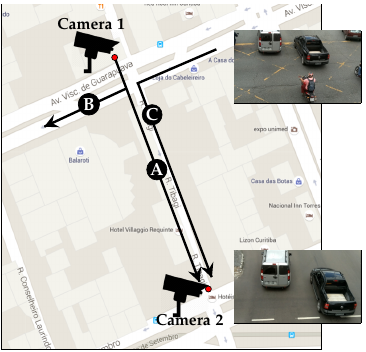

# Demo code for journal "Vehicle Re-identification: exploring feature fusion using multi-stream convolutional networks". (https://arxiv.org/abs/1911.05541)

## Citation

If you find our work useful in your research, please cite our paper:

	@article{oliveira2019vehicle,
	  author = {I. O. {de Oliveira} and R. {Laroca} and D. {Menotti} and K. V. O. {Fonseca} and R. {Minetto}},
	  title = {Vehicle Re-identification: exploring feature fusion using multi-stream convolutional networks},
	  journal = {arXiv preprint},
	  volume = {arXiv:1911.05541},
	  number = {},
	  pages = {1-11},
	  year = {2019},
	}

## Download
- [dataset](http://www.inf.ufpr.br/vri/databases/vehicle-reid/data.tgz)
- [videos](http://www.inf.ufpr.br/vri/databases/vehicle-reid/videos.tgz)
- [models](http://www.inf.ufpr.br/vri/databases/vehicle-reid/models.tgz)

## Authors

- Ícaro Oliveira de Oliveira (UTFPR) [mailto](mailto:icarofua@gmail.com)
- Rayson Laroca (UFPR) [mailto](mailto:raysonlaroca@gmail.com)
- David Menotti (UFPR) [mailto](mailto:menottid@gmail.com)
- Keiko Veronica Ono Fonseca (UTFPR) [mailto](mailto:keikoveronicaono@gmail.com)
- Rodrigo Minetto (UTFPR) [mailto](mailto:rodrigo.minetto@gmail.com)

This work addresses the problem of vehicle re-identification through a network of non-overlapping cameras. 

As our main contribution, we propose a novel two-stream convolutional neural network (CNN) that simultaneously uses two of the most distinctive and persistent features available: the vehicle appearance and its license plate. This is an attempt to tackle a major problem, false alarms caused by vehicles with similar design or by very close license plate identifiers.
In the first network stream, shape similarities are identified by a Siamese CNN that uses a pair of low-resolution vehicle patches recorded by two different cameras. 

In the second stream, we use a CNN for optical character recognition (OCR) to extract textual information, confidence scores, and string similarities from a pair of high-resolution license plate patches. 

Then, features from both streams are merged by a sequence of fully connected layers for decision.  As part of this work, we created an important dataset for vehicle re-identification with more than three hours of videos spanning almost 3,000 vehicles. In our experiments, we achieved a precision, recall and F-score values of 99.6%, 99.2% and 99.4%, respectively.

As another contribution, we discuss and compare three alternative architectures that explore the same features but using additional streams and temporal information.

## 1. Prerequisites
Python 3.6
Keras
Tensorflow
Imgaug

## 1.1 Installation

pip3 install keras==2.2.4 tensorflow==1.12.0 scikit-learn==0.20.3 futures imgaug==0.2.9

## 2 Configuration
config.py

If you prefer to run the model in the second gpu you can use config_1.py instead of config.py in the python code.

You need to change the following line:
from config import *
to
from config_1 import *

For example, you can see in the siamese_shape_stream1.py.

OBS: If you don't decompress the data.tgz in the vehicle-ReId folder, change the parameter path in config.py and config1.py with new path of data.

## 3 Training the algorithms
In this process, the data are loaded from the json file generated for the step 6, and it is runned the process of training and validation.

### 3.1 siamese plate
python3 siamese_plate_stream.py train

### 3.2 siamese shape
You can train the siamese shape with the following algorithms: resnet50, resnet6, resnet8, mccnn, vgg16, googlenet, lenet5, matchnet or smallvgg.

Example: python3 siamese_shape_stream.py train smallvgg

### 3.3 siamese two stream (plate + shape)
python3 siamese_two_stream.py train

### 3.4 siamese three stream (plate + shape + ocr)
python3 siamese_three_stream.py train

### 3.5 siamese two stream (ocr + shape)
python3 siamese_two_stream_ocr.py train

### 3.6 siamese temporal stream with 2 images
python3 siamese_temporal2.py train

### 3.7 siamese temporal stream with 3 images
python3 siamese_temporal3.py train

## 4 Testing the algorithms
In this process, the data are loaded from the json file generated for the step 6.

### 4.1 siamese plate
python3 siamese_plate_stream.py test models/Plate

### 4.2 siamese shape
You can train the siamese shape with the following algorithms: resnet50, resnet6, resnet8, mccnn, vgg16, googlenet, lenet5, matchnet or smallvgg.

Example: python3 siamese_shape_stream.py test smallvgg models/Shape/Smallvgg

### 4.3 siamese two stream (plate + shape)
python3 siamese_two_stream.py test models/Two-Stream-Shape-Plate

### 4.4 siamese three stream (plate + shape + ocr)
python3 siamese_three_stream.py test models/Three-Stream

### 4.5 siamese two stream (ocr + shape)
python3 siamese_two_stream_ocr.py test models/Two-Stream-Shape-OCR

### 4.6 siamese temporal stream with 2 images
python3 siamese_temporal2.py test models/Temporal2

### 4.7 siamese temporal stream with 3 images
python3 siamese_temporal3.py test models/Temporal3

## 5 Predict the algorithms using some samples
In this process, for each algorithm is loaded the models and a json file contained the samples.

### 5.1 siamese plate
python3 siamese_plate_stream.py predict sample_plate.json models/Plate

### 5.2 siamese shape
You can predict the siamese shape with the following algorithms: resnet50, resnet6, resnet8, mccnn, vgg16, googlenet, lenet5, matchnet or smallvgg.

Example: python3 siamese_shape_stream.py predict smallvgg sample_shape.json models/Shape/Smallvgg

### 5.3 siamese two stream (plate + shape)
python3 siamese_two_stream.py predict sample_two.json models/Two-Stream-Shape-Plate

### 5.4 siamese three stream (plate + shape + ocr)
python3 siamese_three_stream.py predict sample_three.json models/Three-Stream

### 5.5 siamese two stream (ocr + shape)
python3 siamese_two_stream_ocr.py predict sample_two_ocr.json models/Two-Stream-Shape-OCR

### 5.6 siamese temporal stream with 2 images (ocr + shape)
python3 siamese_temporal2.py predict sample_temporal2.json models/Temporal2

### 5.7 siamese temporal stream with 3 images (ocr + shape)
python3 siamese_temporal3.py predict sample_temporal3.json models/Temporal3

### 5.8 OCR model

In the OCR folder under models (models.tgz), you must first run "make" in the "darknet" folder 
to compile Darknet and then run "python33 cnn-ocr.py image_file" in the same folder to run the CNN-OCR 
model.
For more information, please refer to the README.txt file in the OCR folder.

## 6. Generating the Datasets
You can generate the datasets for 1 image or the temporal stream between 2 to 5 images.

Example: python3 generate_n_sets.py 1
or
python3 generate_n_sets.py 2

