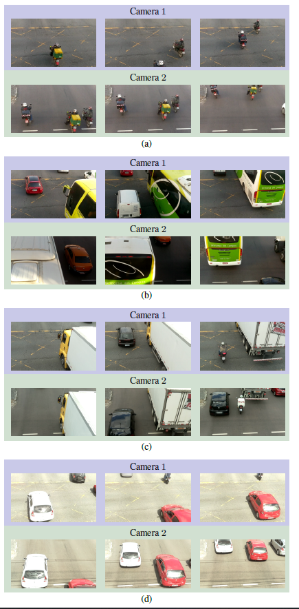
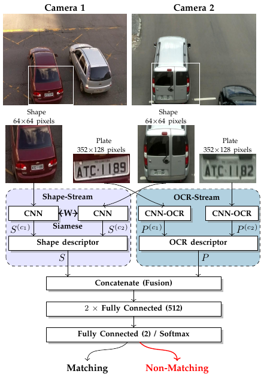
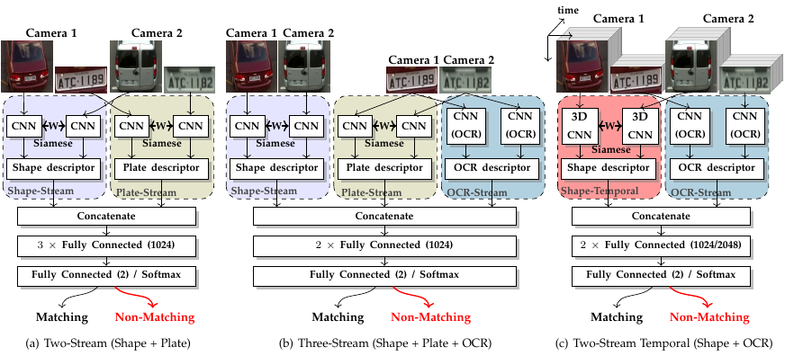

# "Vehicle-Rear: A New Dataset to Explore Feature Fusion For Vehicle Identification Using Convolutional Neural Networks" &ndash; (https://arxiv.org/abs/1911.05541)

## Authors
Ícaro Oliveira de Oliveira, Rayson Laroca, David Menotti, Keiko Veronica Ono Fonseca, Rodrigo Minetto

## Description

This work addresses the problem of vehicle re-identification through a network of non-overlapping cameras. As our main contribution, we introduce a novel dataset for vehicle identification, called **Vehicle-Rear**, that contains more than three hours of high-resolution videos, with accurate information about the make, model, color and year of nearly 3,000 vehicles, in addition to the position and identification of their license plates. Here are some examples from the dataset:



In the image above, the temporal sequences show examples of (a) motorcycles; (b) cars and buses; (c) trucks; (a) and (c) in normal weather conditions; (b) dark frames caused by the motion of large vehicles; and (d) severe lighting conditions.

To explore our dataset, we design a **two-stream Convolutional Neural Network (CNN) that simultaneously uses two of the most distinctive and persistent features available: the vehicle’s appearance and its license plate**. In the first network stream, shape similarities are identified by a Siamese CNN that uses a pair of low-resolution vehicle patches recorded by two different cameras. In the second stream, we use a CNN for Optical Character Recognition (OCR) to extract textual information, confidence scores, and string similarities from a pair of high-resolution license plate patches. Then, features from both streams are merged by a sequence of fully connected layers for decision. A demo video can be seen [**here**](https://youtu.be/0FoiyMTTQJs).



In our experiments, we compared the two-stream network against several well-known CNN architectures using single or multiple vehicle features. The proposed architecture achieved precision, recall and F-score values of 99.35%, 98.5%, 98.92%, respectively. The combination of both features (vehicle shape and OCR) brought an F-score boost of nearly 5%, solving very challenging instances of this problem such as distinct vehicles with very similar shapes or license plate identifiers.

| Architectures                                 | Precision      | Recall      | F-score      |
|-----------------------------------------------|--------|--------|--------|
| One-Stream (Plate)                            | 88.49% | 75.28% | 80.83% |
| One-Stream (CNN-OCR)                          | 100.0% | 88.80% | 94.10% |
| One-Stream (Shape)                            | 90.43% | 92.54% | 91.35% |
| Two-Stream (Shape + Plate)                    | 91.15% | 91.93% | 91.47% |
| **Two-Stream (Shape + CNN-OCR)**                  | **99.35%** | **98.50%** | **98.92%** |

  
  
#### Additional Experiments
As an additional contribution, we present three alternative architectures that explore the same features but using additional streams and temporal information.


Vehicle re-identification performance for alternative architectures that explores the use of additional streams, features, and temporal information. 

| Architectures                                 | Precision      | Recall      | F-score      |
|-----------------------------------------------|--------|--------|--------|
| **Two-Stream (Shape + CNN-OCR)**                  | **99.35%** | **98.50%** | **98.92%** |
| Two-Stream-Temporal, k = 2, (Shape + CNN-OCR) | 99.88% | 98.84% | 99.35% |
| Two-Stream-Temporal, k = 3, (Shape + CNN-OCR) | 99.74% | 98.77% | 99.26% |
| Three-Stream (Shape + Plate + CNN-OCR)        | 99.52% | 98.09% | 98.80% |

## Citation

If you find our work useful in your research, please cite our paper:

	@article{oliveira2021vehicle,
	  author = {I. O. {de Oliveira} and R. {Laroca} and D. {Menotti} and K. V. O. {Fonseca} and R. {Minetto}},
	  title = {{Vehicle-Rear}: A new dataset to explore feature fusion for vehicle identification using convolutional neural networks},
  	  journal={IEEE Access}, 
	  volume={},
	  number={},
	  pages={},
	  doi={},
	  year = {2021},
	}

## Downloads
- [Dataset](https://www.inf.ufpr.br/vri/databases/vehicle-reid/data.tgz)
- [Videos](https://www.inf.ufpr.br/vri/databases/vehicle-reid/videos.tgz)
- [Models](https://www.inf.ufpr.br/vri/databases/vehicle-reid/models.tgz)

### 1. Prerequisites
- Python 3.6.X
- Keras
- Tensorflow
- Imgaug

To install all python packages, please run the following command:
```
pip3 install -r requirements.txt
```
### 2. Configuration
config.py

If you prefer to run the model in the second GPU you can use config_1.py instead of config.py in the python code.

You need to change the following line:
from config import *
to
from config_1 import *

For example, you can see in the siamese_shape_stream1.py.

P.S.: If you don't decompress the data.tgz in the vehicle-ReId folder, change the parameter path in config.py and config1.py with new path of data.

### 3. Training the algorithms
In this process, the data are loaded from the JSON file generated for step 6, and it is run the process of training and validation.

#### 3.1 Siamese plate
```
python3 siamese_plate_stream.py train
```
#### 3.2 Siamese shape
You can train the siamese shape with the following algorithms: resnet50, resnet6, resnet8, mccnn, vgg16, googlenet, lenet5, matchnet or smallvgg.

Example: 
```
python3 siamese_shape_stream.py train smallvgg
```

#### 3.3 Siamese two stream (plate + shape)
```
python3 siamese_two_stream.py train
```

#### 3.4 Siamese three stream (plate + shape + ocr)
```
python3 siamese_three_stream.py train
```

#### 3.5 Siamese two stream (ocr + shape)
```
python3 siamese_two_stream_ocr.py train
```

#### 3.6 Siamese temporal stream with 2 images
```
python3 siamese_temporal2.py train
```

#### 3.7 Siamese temporal stream with 3 images
```
python3 siamese_temporal3.py train
```

### 4. Testing the algorithms
In this process, the data are loaded from the json file generated for step 6.

#### 4.1 Siamese plate
```
python3 siamese_plate_stream.py test models/Plate
```

#### 4.2 Siamese shape
You can train the siamese shape with the following models: resnet50, resnet6, resnet8, mccnn, vgg16, googlenet, lenet5, matchnet or smallvgg.

Example: 
```
python3 siamese_shape_stream.py test smallvgg models/Shape/Smallvgg
```

#### 4.3 Siamese two stream (plate + shape)
```
python3 siamese_two_stream.py test models/Two-Stream-Shape-Plate
```

#### 4.4 Siamese three stream (plate + shape + ocr)
```
python3 siamese_three_stream.py test models/Three-Stream
```

#### 4.5 Siamese two stream (ocr + shape)
```
python3 siamese_two_stream_ocr.py test models/Two-Stream-Shape-OCR
```

#### 4.6 Siamese temporal stream with 2 images
```
python3 siamese_temporal2.py test models/Temporal2
```

#### 4.7 Siamese temporal stream with 3 images
```
python3 siamese_temporal3.py test models/Temporal3
```

### 5. Predict the algorithms using some samples
In this process, for each algorithm is loaded the models and a JSON file contained the samples.

#### 5.1 Siamese plate
```
python3 siamese_plate_stream.py predict sample_plate.json models/Plate
```

#### 5.2 Siamese shape
You can predict the Siamese shape with the following models: resnet50, resnet6, resnet8, mccnn, vgg16, googlenet, lenet5, matchnet or smallvgg.

Example: 
```
python3 siamese_shape_stream.py predict smallvgg sample_shape.json models/Shape/Smallvgg
```

#### 5.3 Siamese two stream (plate + shape)
```
python3 siamese_two_stream.py predict sample_two.json models/Two-Stream-Shape-Plate
```

#### 5.4 Siamese three stream (plate + shape + ocr)
```
python3 siamese_three_stream.py predict sample_three.json models/Three-Stream
```

#### 5.5 Siamese two stream (ocr + shape)
```
python3 siamese_two_stream_ocr.py predict sample_two_ocr.json models/Two-Stream-Shape-OCR
```

#### 5.6 Siamese temporal stream with 2 images (ocr + shape)
```
python3 siamese_temporal2.py predict sample_temporal2.json models/Temporal2
```

#### 5.7 Siamese temporal stream with 3 images (ocr + shape)
```
python3 siamese_temporal3.py predict sample_temporal3.json models/Temporal3
```

#### 5.8 OCR model

In the OCR folder under models (models.tgz), you must first run "make" in the "darknet" folder 
to compile Darknet and then run "python3 cnn-ocr.py image_file" in the same folder to run the CNN-OCR 
model.
For more information, please refer to the README.txt file in the OCR folder.


### 6. Generating the Datasets
You can generate the datasets for 1 image or the temporal stream between 2 to 5 images.

Example: 
```
python3 generate_n_sets.py 1
```
or
```
python3 generate_n_sets.py 2
```

## Contact

Please contact Ícaro Oliveira de Oliveira ([ioliveira@alunos.utfpr.edu.br](mailto:ioliveira@alunos.utfpr.edu.br)) with questions or comments.
